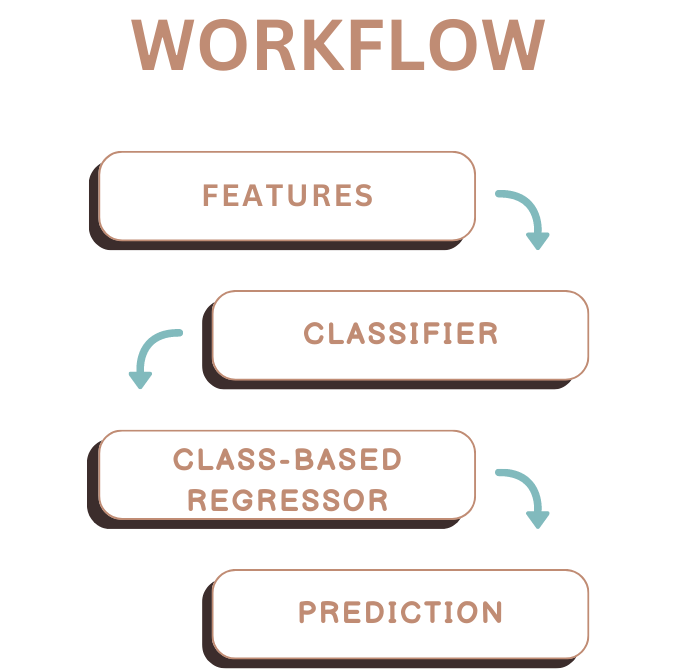

*[back](../README.md)*
# Machine Learning Assisted Alloy Development

The traditional methodology for alloy design predominantly relies on a trial-and-error approach anchored in domain-specific knowledge. While effective, this approach can be protracted and financially demanding. By integrating machine learning and other computational methods, the design process's speed can be significantly increased. This is achieved in two ways: Firstly, by supporting the decision-making process via predictive modelling, reducing the time spent in iterative experimentation; Secondly, by adopting an inverse design approach, where alloys are suggested directly based on predefined desirable properties.

