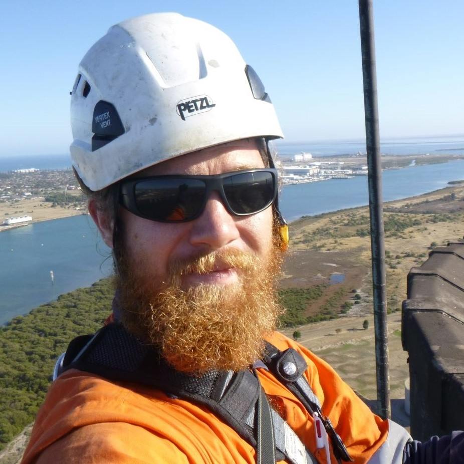

*[back](../README.md)*
# Dymock Dibb

Dymock is a senior consulting engineer and currently undertaking a PhD at the Australian National University. He has previously worked in management and engineering roles within the remediation industry and is currently researching the application of artificial intelligence to infrastructure inspection / management systems.

## Projects

## Contact details