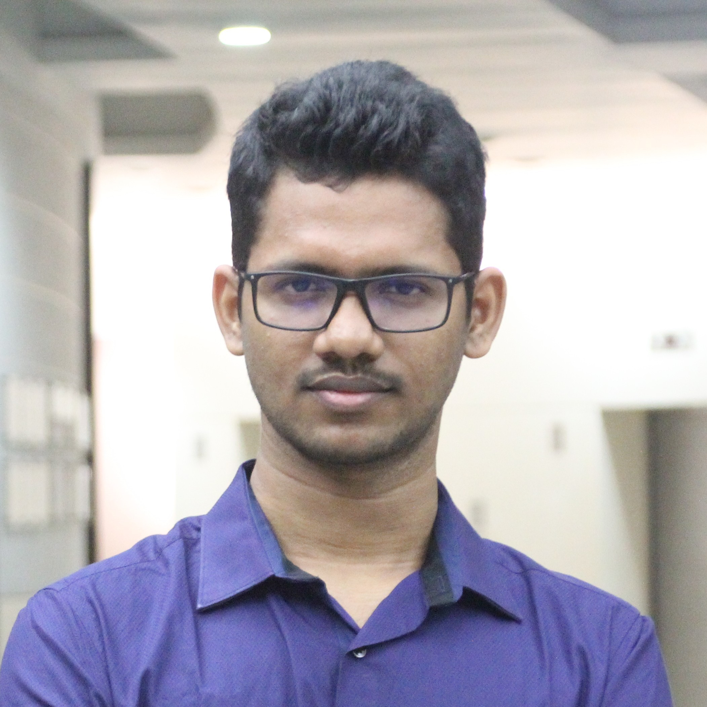

*[back](../README.md)*
# Ninad Bhat

After completing my B.Tech and M.Tech at IIT Bombay in 2019, I moved on to a PhD program at the School of Engineering ANU. My work centres around using machine learning to develop new aluminium alloys. I've had the opportunity to intern at both Monash University and NanoCube in the past. I also enjoy contributing to open-source projects, having participated in google summer of Code. In my free time, I enjoy training Jiu-Jitsu and cooking.

## Projects

## Contact details